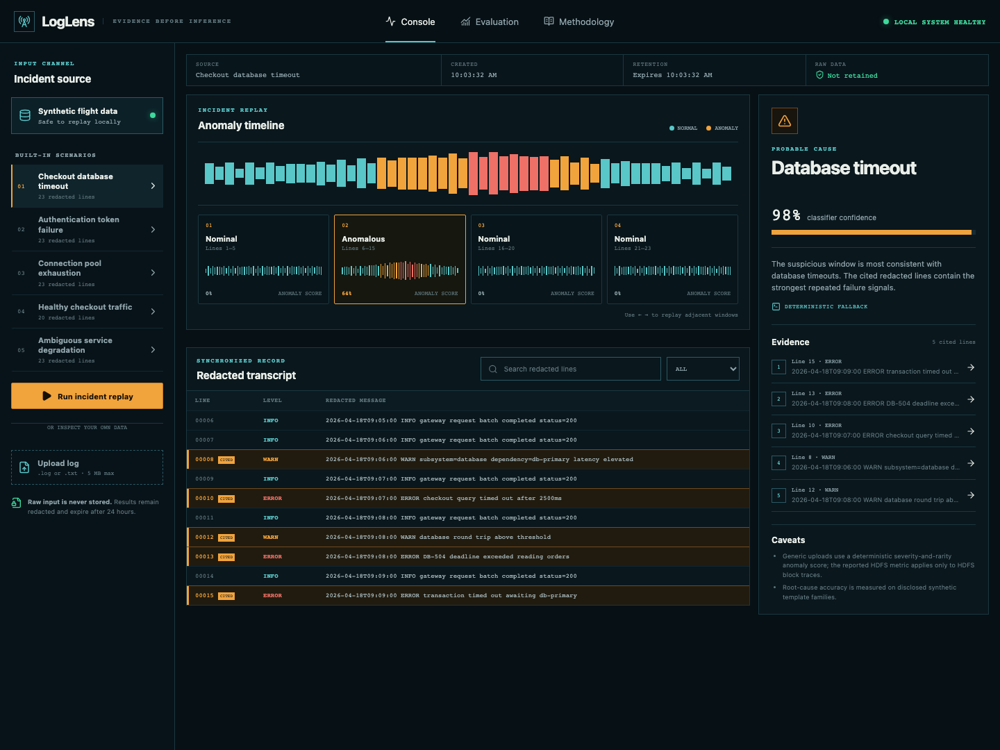
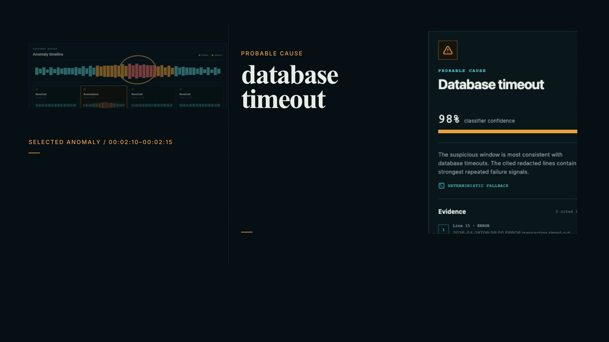
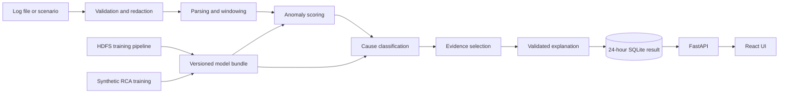

# LogLens

LogLens is a small incident-analysis app for plain-text logs. It finds suspicious windows, suggests a likely cause, and links every explanation back to the exact redacted lines that support it.



## What it does

- Replays a log as a timeline of scored windows.
- Classifies six supported outcomes, including `unknown` when confidence is low.
- Redacts common secrets and identifiers before analysis or storage.
- Keeps explanations grounded with line-level citations.
- Runs without an API key using a deterministic local explainer.
- Exposes the same workflow through a React interface and a FastAPI API.

## Try it locally

You need Docker and Docker Compose.

```bash
git clone https://github.com/SaiDheerajPeketi/LogLens.git
cd LogLens
docker compose up --build
```

Open [http://localhost:8080](http://localhost:8080). The app includes several synthetic incidents, so you can explore the full workflow without uploading a file.

Some Docker installations use the standalone `docker-compose` command. If `docker compose` is unavailable, run `docker-compose up --build` instead.

## Walkthrough

[](https://youtu.be/NRXxuTyRWns)

[Watch the 60-second walkthrough on YouTube](https://youtu.be/NRXxuTyRWns), or [open the MP4 directly](video/loglens-walkthrough.mp4).

## How it works

```text
validate -> redact -> parse -> group -> score -> classify -> cite -> explain
```

1. The upload is checked for file type, size, encoding, and line count.
2. Credentials, email addresses, IP addresses, and user identifiers are redacted.
3. Log lines are parsed into timestamps, severity levels, identifiers, and normalized templates.
4. Lines are grouped by correlation ID, five-minute time window, or overlapping line window.
5. Each window receives an anomaly score and a probable cause.
6. The strongest supporting lines are selected as evidence.
7. An explanation is generated and every citation is checked against that evidence.

Raw uploads stay in memory and are discarded after processing. Redacted results are stored in SQLite for 24 hours.

## Models and evaluation

LogLens uses two separate evaluation tracks because the public HDFS dataset has anomaly labels but no root-cause labels.

| Task | Dataset | Result |
| --- | --- | ---: |
| Anomaly detection | LogHub HDFS_v1, 115,013 held-out traces | 0.9994 PR-AUC |
| Anomaly detection | LogHub HDFS_v1, validation-selected threshold | 0.9956 F1 |
| Anomaly detection | LogHub HDFS_v1 | 0.0002 false-positive rate |
| Root-cause classification | 150 synthetic incidents from held-out template families | 1.0000 macro-F1 |
| Explanation integrity | Six end-to-end runtime cases | 15/15 valid citations |

The HDFS metrics apply only to the packaged HDFS anomaly model. Generic uploads use a severity-and-template-rarity score because their event vocabulary does not match HDFS. The root-cause result measures separation between synthetic template families; it is not a claim about production incident accuracy.

See [the evaluation report](docs/EVALUATION.md) for the split strategy, confusion matrices, and limitations.

## Architecture



The packaged XGBoost model is used for the HDFS benchmark. The runtime scorer handles arbitrary uploads, while a calibrated linear classifier estimates supported cause probabilities.

## API

| Method | Endpoint | Description |
| --- | --- | --- |
| `POST` | `/api/v1/analyses` | Submit a scenario or multipart log upload |
| `GET` | `/api/v1/analyses/{id}` | Read status and results |
| `GET` | `/api/v1/analyses/{id}/events` | Page through redacted events |
| `POST` | `/api/v1/analyses/{id}/retry` | Retry a built-in scenario |
| `GET` | `/api/v1/scenarios` | List built-in incidents |
| `GET` | `/api/v1/model-card` | Read model scope and metrics |
| `GET` | `/api/v1/health` | Check application and model readiness |

Interactive API documentation is available at [http://localhost:8080/docs](http://localhost:8080/docs) while the service is running.

## Development

The short version:

```bash
uv sync --extra dev --frozen
npm ci --prefix frontend
cp .env.example .env

uv run uvicorn loglens.main:app --reload --host 127.0.0.1 --port 8000
npm run dev --prefix frontend
```

Run the backend checks:

```bash
uv run ruff check backend
uv run mypy backend/loglens
uv run pytest
```

Run the frontend checks:

```bash
npm test --prefix frontend
npm run build --prefix frontend
```

For dataset download, model training, browser tests, environment variables, and troubleshooting, see [docs/SETUP.md](docs/SETUP.md).

## Repository layout

```text
backend/loglens/       FastAPI service, analysis pipeline, and training code
backend/tests/         Backend and model tests
frontend/src/          React application
frontend/e2e/          Playwright workflows
artifacts/models/      Versioned model bundles and manifest
artifacts/evaluation/  Machine-readable evaluation results
docs/                  Setup, evaluation, deployment, and design notes
video/                 Rendered walkthrough and poster
videos/                Walkthrough source files
```

## Privacy and limitations

- Uploads are limited to UTF-8 `.log` and `.txt` files up to 5 MB or 50,000 lines.
- Raw upload bytes are not written to disk.
- Redacted derived results expire after 24 hours.
- The optional OpenAI explainer receives only selected redacted evidence and uses response storage disabled.
- Automated redaction is defense in depth, not a guarantee. Use synthetic or non-confidential logs.
- SQLite and the in-process worker are designed for a single application instance.
- There is no authentication, saved workspace, or streaming ingestion.

## More documentation

- [Setup and development](docs/SETUP.md)
- [Evaluation details](docs/EVALUATION.md)
- [Deployment notes](docs/DEPLOYMENT.md)
- [Engineering decisions](docs/DECISIONS.md)
- [Product notes](PRODUCT.md)
- [Interface design](DESIGN.md)

## License

[MIT](LICENSE)
