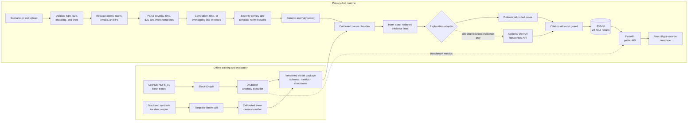
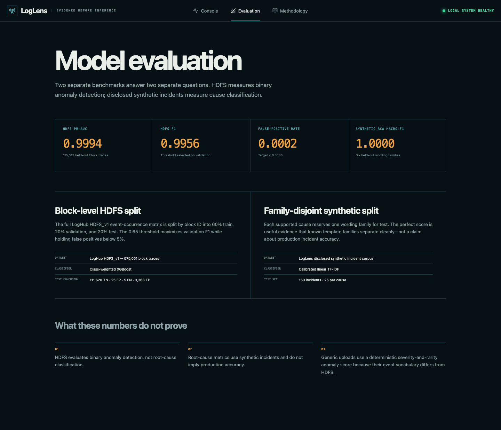
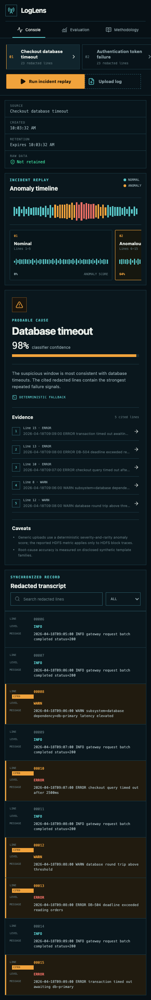

# LogLens

Evidence-first log anomaly detection and root-cause analysis.

LogLens turns a small plain-text log into a replayable incident timeline, a probable cause, and an explanation tied to exact redacted lines. It deliberately separates what was measured on real data from what was learned from synthetic incidents.

> **Delivery status:** the production Docker demo is verified locally at `http://localhost:8080`. Public cloud hosting and public repository visibility are deferred; this project does not claim a public live URL or public source access.


## Why this project exists

An anomaly score alone does not help an engineer decide what to inspect next. LogLens connects three questions in one interface:

1. **When did behavior become suspicious?** A replayable timeline ranks log windows.
2. **What supported cause best fits the window?** A calibrated classifier can also resolve to “unknown—needs human review.”
3. **What evidence supports that answer?** Every explanation citation links to an exact redacted transcript line.

## Measured results

| Evaluation | Held-out result | Scope |
| --- | ---: | --- |
| HDFS anomaly PR-AUC | **0.9994** | 115,013 block traces |
| HDFS anomaly F1 | **0.9956** | Validation-selected threshold 0.65 |
| HDFS false-positive rate | **0.0002** | 25 false positives / 111,645 normal traces |
| Synthetic RCA macro-F1 | **1.0000** | 150 incidents from held-out template families |
| Explanation citation validity | **100%** | 15 / 15 citations across six runtime cases |
| Raw upload retention | **0 files** | Sensitive upload probe and temporary SQLite scan |

These results are not interchangeable. HDFS validates binary anomaly detection; it has no root-cause labels. The RCA score measures family-disjoint synthetic incidents and is not a production-accuracy claim. Arbitrary uploads use a disclosed severity-and-template-rarity anomaly score because their event vocabulary does not match HDFS.

See [the complete evaluation report](docs/EVALUATION.md) and [machine-readable artifacts](artifacts/evaluation/metrics.json).

## Quick start

Requirements: Docker Engine and Docker Compose.

The repository is currently private. The clone command below requires GitHub access granted by the owner; otherwise, run the same commands from an authorized local checkout.

```bash
git clone https://github.com/SaiDheerajPeketi/LogLens.git
cd LogLens
docker compose up --build
```

Open [http://localhost:8080](http://localhost:8080). If your installation provides the standalone command, use `docker-compose up --build` instead; that is the command used for the verified local run.

The first page includes safe synthetic incidents. An OpenAI key is not required—the cited deterministic explanation is the default fallback.

## Architecture



The XGBoost model measures HDFS anomaly performance. It is not silently applied to unrelated event vocabularies. Generic uploads use the runtime scorer shown above, while the packaged calibrated RCA model supplies supported cause probabilities and line-level contributions.

## Product surfaces

- **Analysis console:** source controls, synchronized timeline, diagnosis rail, and redacted transcript.
- **Incident detail:** probability, caveats, explanation mode, and focus links to cited evidence.
- **Evaluation page:** held-out metrics, split boundaries, confusion counts, and honest limitations.
- **Methodology and privacy:** the full trust boundary from validation through expiry.
- **Mobile reading flow:** source → timeline → diagnosis → transcript at 390 pixels.

<details>
<summary>More screenshots</summary>





</details>

## Data and models

- **Binary anomaly evaluation:** [LogHub HDFS_v1](https://github.com/logpai/loghub/blob/master/HDFS/README.md), split 60/20/20 by block ID to prevent trace leakage.
- **Root-cause evaluation:** a disclosed generated corpus covering database timeout, authentication failure, connection-pool exhaustion, disk pressure, network/DNS failure, and unknown. One wording family per cause is held out.
- **Generic parsing:** [Drain-style](https://github.com/logpai/logparser/blob/main/docs/tools/Drain.md) normalized event templates, with correlation IDs preferred over five-minute time windows and overlapping 200-line windows.
- **Packaging:** every model bundle includes its dataset version, feature schema, threshold, metrics, build commit, and SHA-256 checksums.

The official HDFS archive and raw derived datasets are intentionally excluded from Git. The download command pins and verifies their published checksums.

## Privacy and explanation contract

The runtime order is fixed:

`validate → redact → parse → window → score → classify → select evidence → explain`

- Uploads accept UTF-8 `.log` and `.txt` files up to 5 MB or 50,000 lines.
- Credentials, tokens, emails, IP addresses, and user identifiers are redacted before persistence or external transmission.
- Raw upload bytes are never written to disk; redacted derived results expire after 24 hours.
- The optional external adapter receives only the selected redacted evidence and derived prediction metadata, uses strict structured output, and disables response storage.
- Every returned citation must belong to the supplied evidence. A timeout, refusal, malformed result, or invalid citation resolves to deterministic cited prose.
- The public demo is for synthetic or non-confidential logs. Automated redaction is defense in depth, not a guarantee.

## API

| Method | Endpoint | Purpose |
| --- | --- | --- |
| `POST` | `/api/v1/analyses` | Submit multipart upload or `{ "scenario_id": "…" }` |
| `GET` | `/api/v1/analyses/{id}` | Read lifecycle, scores, causes, evidence, and explanation |
| `GET` | `/api/v1/analyses/{id}/events?cursor=…` | Page through redacted events |
| `POST` | `/api/v1/analyses/{id}/retry` | Retry reproducible scenario work |
| `GET` | `/api/v1/scenarios` | List built-in incidents |
| `GET` | `/api/v1/model-card` | Read model scope and measured metrics |
| `GET` | `/api/v1/health` | Read application and model readiness |

Interactive OpenAPI documentation is available at `http://localhost:8080/docs`.

## Development and verification

The detailed [setup guide](docs/SETUP.md) covers native development, dataset acquisition, training, tests, environment variables, Docker, and troubleshooting.

The repository verifies:

- 28 backend tests for ingestion, parsing, model manifests, persistence, API states, citations, fallbacks, expiry, and runtime integrity;
- 5 React interaction and accessibility tests;
- 5 production-browser workflows for built-in analysis, upload, no anomaly, low confidence, and deterministic fallback;
- lint, strict type checking, production builds, dependency audit, and container health in CI.

## Walkthrough

[](video/loglens-walkthrough.mp4)

[Watch the 60-second walkthrough](video/loglens-walkthrough.mp4). The committed deliverable is a silent 1920×1080 H.264 MP4 at 30 fps. It uses real product captures and measured results, and it ends by stating that public hosting is deferred.

## Cloud readiness

Public deployment is intentionally deferred. [The cloud runbook](docs/DEPLOYMENT.md) provides a concrete Render path using the committed Dockerfile, `/api/v1/health`, and a single attached disk for SQLite. It also explains why that configuration cannot scale horizontally and when to move to Postgres and a durable queue.

## Limitations and roadmap

- Generic anomaly scoring is deterministic and does not inherit the HDFS model's metrics.
- Synthetic RCA scores do not establish production incident accuracy.
- Drain-style templates are intentionally lightweight and may group unfamiliar formats poorly.
- SQLite and the in-process worker require one application instance.
- There is no authentication, saved workspace, streaming ingestion, or public hosted instance in this release.

Next steps are a representative cause-labeled operational dataset, format-specific parsers, Postgres plus a durable worker, authenticated workspaces, and a public deployment after an explicit privacy review.

## Project record

- [Product brief](PRODUCT.md)
- [Decision journal](docs/DECISIONS.md)
- [Evaluation report](docs/EVALUATION.md)
- [Design system](DESIGN.md)
- [Resume description](docs/RESUME.md)
- [MIT license](LICENSE)
